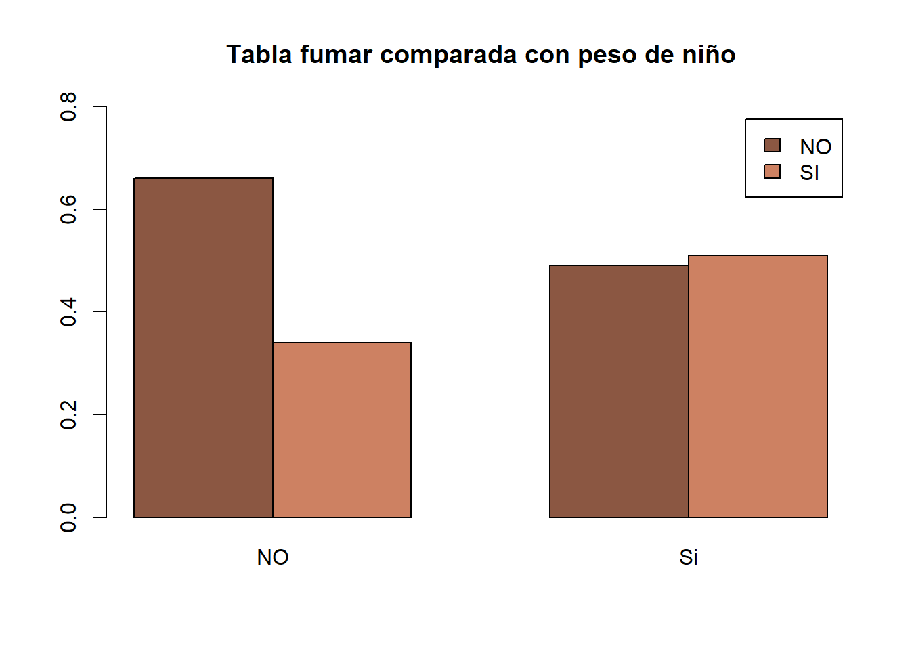

#### **Introduccion**

What is Lorem Ipsum?
Lorem Ipsum is simply dummy text of the printing and typesetting industry. Lorem Ipsum has been the industry's standard dummy text ever since the 1500s, when an unknown printer took a galley of type and scrambled it to make a type specimen book. It has survived not only five centuries, but also the leap into electronic typesetting, remaining essentially unchanged. It was popularised in the 1960s with the release of Letraset sheets containing Lorem Ipsum passages, and more recently with desktop publishing software like Aldus PageMaker including versions of Lorem Ipsum.


```r
kable(head(birthwt), caption = "Tabla genral de variables")
```


Table: Tabla genral de variables

      low   age   lwt   race   smoke   ptl   ht   ui   ftv    bwt
---  ----  ----  ----  -----  ------  ----  ---  ---  ----  -----
85      0    19   182      2       0     0    0    1     0   2523
86      0    33   155      3       0     0    0    0     3   2551
87      0    20   105      1       1     0    0    0     1   2557
88      0    21   108      1       1     0    0    1     2   2594
89      0    18   107      1       1     0    0    1     0   2600
91      0    21   124      3       0     0    0    0     0   2622


Table: Table de variable Actualizada

     low    age   lwt  race     smoke    ptl   ht   ui   ftv    bwt
---  ----  ----  ----  -------  ------  ----  ---  ---  ----  -----
85   NO      19   182  Negro    NO         0    0    1     0   2523
86   NO      33   155  Otros    NO         0    0    0     3   2551
87   NO      20   105  Blanco   SI         0    0    0     1   2557
88   NO      21   108  Blanco   SI         0    0    1     2   2594
89   NO      18   107  Blanco   SI         0    0    1     0   2600
91   NO      21   124  Otros    NO         0    0    0     0   2622


#### **Tabla de frecuencias relativas marginales de los pares (raza de la madre, peso inferior a 2.5 kg o no)**

            NO     Si
-------  -----  -----
Blanco    0.56   0.39
Negro     0.12   0.19
Otros     0.32   0.42


#### Tabla de frencuencia relativa marginales de los pares (fumar por peso)


        NO     Si
---  -----  -----
NO    0.66   0.49
SI    0.34   0.51



```r
tablaMutiVariable <- table(birthwtModificada$low, birthwtModificada$smoke, birthwtModificada$race)
prop.table(tablaMutiVariable)
```

```
## , ,  = Blanco
## 
##     
##              NO         SI
##   NO 0.21164021 0.17460317
##   Si 0.02116402 0.10052910
## 
## , ,  = Negro
## 
##     
##              NO         SI
##   NO 0.05820106 0.02116402
##   Si 0.02645503 0.03174603
## 
## , ,  = Otros
## 
##     
##              NO         SI
##   NO 0.18518519 0.03703704
##   Si 0.10582011 0.02645503
```

```r
 kable(round(prop.table(tablaMutiVariable, margin = 1),2),"html")
```

<table>
 <thead>
  <tr>
   <th style="text-align:left;"> Var1 </th>
   <th style="text-align:left;"> Var2 </th>
   <th style="text-align:left;"> Var3 </th>
   <th style="text-align:right;"> Freq </th>
  </tr>
 </thead>
<tbody>
  <tr>
   <td style="text-align:left;"> NO </td>
   <td style="text-align:left;"> NO </td>
   <td style="text-align:left;"> Blanco </td>
   <td style="text-align:right;"> 0.31 </td>
  </tr>
  <tr>
   <td style="text-align:left;"> Si </td>
   <td style="text-align:left;"> NO </td>
   <td style="text-align:left;"> Blanco </td>
   <td style="text-align:right;"> 0.07 </td>
  </tr>
  <tr>
   <td style="text-align:left;"> NO </td>
   <td style="text-align:left;"> SI </td>
   <td style="text-align:left;"> Blanco </td>
   <td style="text-align:right;"> 0.25 </td>
  </tr>
  <tr>
   <td style="text-align:left;"> Si </td>
   <td style="text-align:left;"> SI </td>
   <td style="text-align:left;"> Blanco </td>
   <td style="text-align:right;"> 0.32 </td>
  </tr>
  <tr>
   <td style="text-align:left;"> NO </td>
   <td style="text-align:left;"> NO </td>
   <td style="text-align:left;"> Negro </td>
   <td style="text-align:right;"> 0.08 </td>
  </tr>
  <tr>
   <td style="text-align:left;"> Si </td>
   <td style="text-align:left;"> NO </td>
   <td style="text-align:left;"> Negro </td>
   <td style="text-align:right;"> 0.08 </td>
  </tr>
  <tr>
   <td style="text-align:left;"> NO </td>
   <td style="text-align:left;"> SI </td>
   <td style="text-align:left;"> Negro </td>
   <td style="text-align:right;"> 0.03 </td>
  </tr>
  <tr>
   <td style="text-align:left;"> Si </td>
   <td style="text-align:left;"> SI </td>
   <td style="text-align:left;"> Negro </td>
   <td style="text-align:right;"> 0.10 </td>
  </tr>
  <tr>
   <td style="text-align:left;"> NO </td>
   <td style="text-align:left;"> NO </td>
   <td style="text-align:left;"> Otros </td>
   <td style="text-align:right;"> 0.27 </td>
  </tr>
  <tr>
   <td style="text-align:left;"> Si </td>
   <td style="text-align:left;"> NO </td>
   <td style="text-align:left;"> Otros </td>
   <td style="text-align:right;"> 0.34 </td>
  </tr>
  <tr>
   <td style="text-align:left;"> NO </td>
   <td style="text-align:left;"> SI </td>
   <td style="text-align:left;"> Otros </td>
   <td style="text-align:right;"> 0.05 </td>
  </tr>
  <tr>
   <td style="text-align:left;"> Si </td>
   <td style="text-align:left;"> SI </td>
   <td style="text-align:left;"> Otros </td>
   <td style="text-align:right;"> 0.08 </td>
  </tr>
</tbody>
</table>

```r
round(prop.table(tablaMutiVariable, margin = 2),2)
```

```
## , ,  = Blanco
## 
##     
##        NO   SI
##   NO 0.35 0.45
##   Si 0.03 0.26
## 
## , ,  = Negro
## 
##     
##        NO   SI
##   NO 0.10 0.05
##   Si 0.04 0.08
## 
## , ,  = Otros
## 
##     
##        NO   SI
##   NO 0.30 0.09
##   Si 0.17 0.07
```

